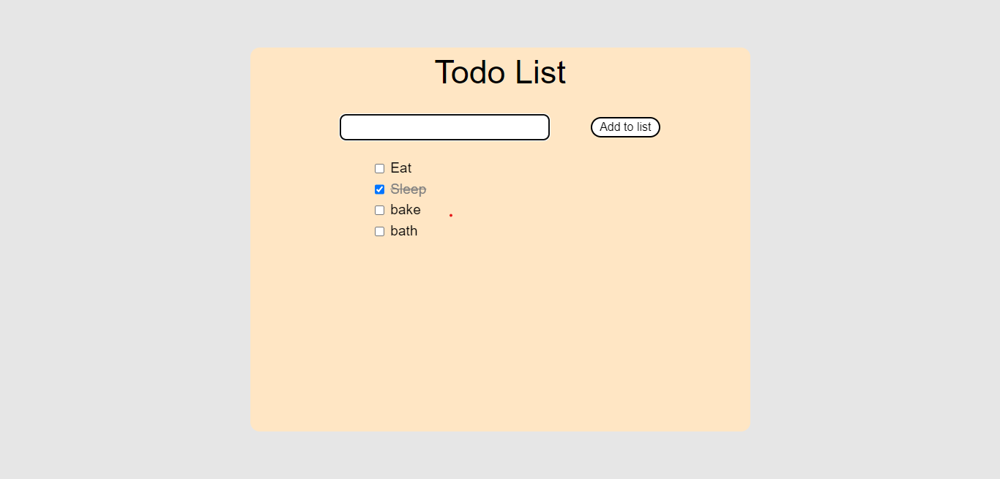

# To-do-List

Todo List: This project add, save and also check list of texts.... if a text is completed it can be checked with the click of a button. it has a full mobile phone responsiveness

## Getting Started

Clone or download this repository and run with a local server of open `index.html` with your favorite browser

## Prequisite

- Your browser version must be recent for a better experience

## Features

- Add Page

## Tech/framework used

- HTML
- CSS
- ReactJS
- Vite
- Tailwind-CSS

## Preview

[Preview Here](https://deft-speculoos-2d339c.netlify.app)

## Contact

If you want to contact me you can reach me at
-wolabash@gmail.com -https://github.com/PrimeFord

## Addtional Info

- This is one of the series of project for the @Codevillage Programming Lessons.
- This is not meant for production. It's for learning purpose only
